# How I Finally Installed Win11 on ASUS TUF F15: A Full Guide for Anyone Struggling with Installation Issues

**Disclaimer:** I originally wrote this guide in 2024 after spending nearly two days troubleshooting the Windows 11 installation on my ASUS TUF F15. I never got around to publishing it until now. Some details may be slightly outdated, but the core tips, tricks, and keyboard workarounds could still save you a massive headache. Hopefully someone still can find this useful.

Also available on DEV Community [here](https://dev.to/lazlowcooper/how-i-finally-installed-win11-on-asus-tuf-f15-a-full-guide-for-anyone-struggling-with-installation-2lhb).

------------------------------------------------------------------------

I would like to share my win11 installation journey with anyone who's interested, how I managed to complete the whole process from start to finish. There are many posts and sources available already, my goal was just to put them all together to give a concise overview from my perspective. Additionally, I bumped into numerous unexpected hurdles along the way, hopefully my experience, tips and tricks could be helpful, and may save some future frustration.

Table of contents:

1. Action 1. - using IRST driver from ASUS website
2. Action 2. - toggle VMD controller disabled/enabled
3. Action 3. - burn ISO to USB stick using Rufus
4. Action 4. - IRST driver from INTEL website
5. Additional issues - no network adapter driver, running out of USB ports

I bought an ASUS TUF F15 notebook, without operating system. I originally had a Win10 installer with license key and apparently there's an option to upgrade to Win11, so I didn't need to buy a new license key, hence I thought I would just do this myself.

So I downloaded the Win11 installer from the [download page](https://www.microsoft.com/en-us/software-download/windows11) using the _Create Windows 11 Installation Media_ option. The media tool puts all the relevant files onto a USB stick.

As instructed by the ASUS TUF instruction manual, I charged the batteries for 3 hours. Then I inserted this USB stick into the notebook and turned it on. Pressed F2 to open the Boot menu, where I made the required settings modifications as per my research, that is:

- Advanced mode (F7) / Advanced/ VMD Setup Menu / Enable VMD controller: Enabled (According to [this source](https://youtu.be/yL73D_m2Y3o?si=3ag1GgolCCEt5W-h), this is the same setting as SATA mode = ACHI. Disabled would mean SATA mode = RAID.)
- Advanced mode (F7) / Boot/ Fast Boot: Disabled
- Advanced mode (F7) / Security / Secure Boot: Disabled

(This is what most of the videos on youtube will tell you.) Pressed Save and exit (F10), machine restarted, Windows installer initialized, selected the language, entered license key etc. Then I arrived to this _Select location to install Win11_ window. As you can see, even after making all the modifications above in the Boot menu, Win11 installer still couldn't recognize my SSD drive, only the 8GB USB stick. It's clear from this error message as well. Clicking on _Show details_ it said: _"The selected disk has an MBR partition table. On EFI Systems, the operating system can only be installed on GPT disks. Setup doesn't support configuration of or installation to disks connected through a USB or IEEE1394 port."_

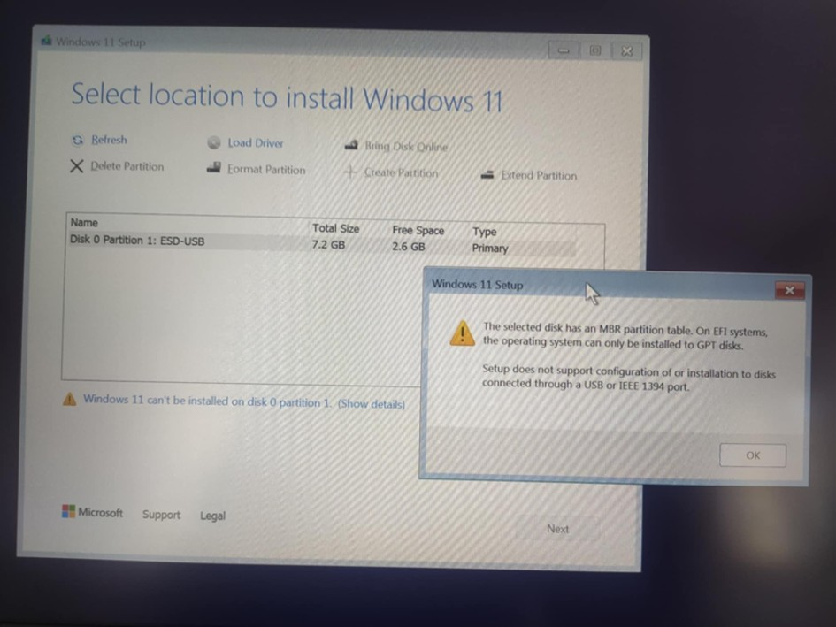

**Action 1. - using IRST driver from ASUS website**

After some research I found out that there is a [driver compatibility issue     ](https://www.intel.com/content/www/us/en/support/articles/000092508/technologies.html)affecting these new generation Intel processors. So I followed the steps exactly as mentioned in [this ASUS video](https://www.youtube.com/watch?v=HuCY0ChsqAM), i.e. downloaded the IRST driver from [ASUS website](https://www.asus.com/supportonly/irst/helpdesk_download/) (RST_V19.1.0.1001_PV), extracted it, copied it to my USB stick (next to the Win11 installer files, into the USB stick's root directory) and restarted the whole installation process.

I arrived again to the _Select location to install Win11_ window, where you can see the _Load driver_ option here:

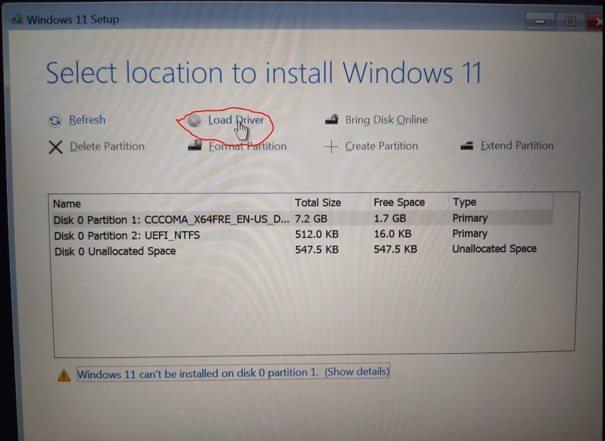

Selected the previously downloaded and extracted driver (RST_V19.1.0.1001_PV)

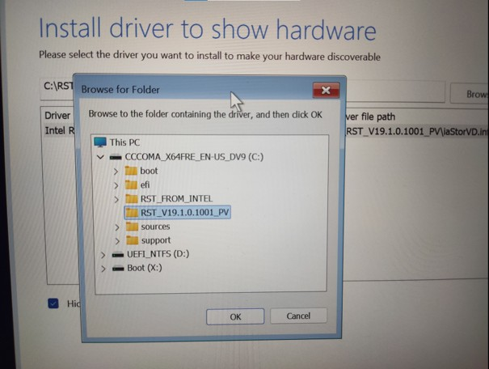

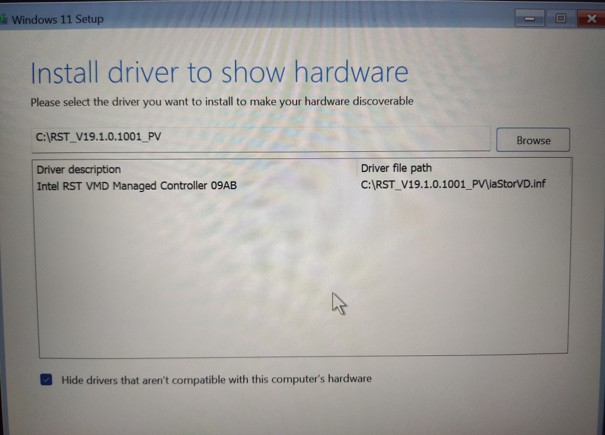

But still, no change. The installer couldn't recognize the SSD. 

**Action 2. - toggle VMD controller disabled/enabled**

According to some sources, you have to go back to the Boot menu, go to Advanced mode (F7) / Advanced / VMD Setup Menu / Enable VMD controller and select _Disabled_, then _Enabled_ again (!). So I did, then I initiated the Windows installer again.

Still, no change. The installer couldn't recognize the SSD.

**Action 3. - burn ISO to USB stick using Rufus**

Then I realized, based on [this reddit post](https://www.reddit.com/r/Asustuf/comments/1eofu2f/windows_installation_cannot_find_ssd_on_asus_tuf/), that maybe the way I created the USB stick (using the Media tool option) was wrong. User u/LuciaGiurato suggests trying to download the Win11 in iso format from the official Windows site, then burn this iso to the USB stick using Rufus. So I did. Downloaded the ISO file, then...

a.) ...burnt it to the USB stick, set partition scheme to MBR and started the whole installation process all over again.

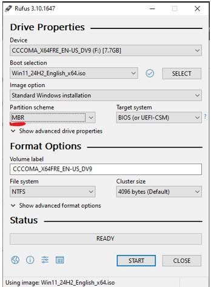

Still, no change. The installer couldn't recognize the SSD.

b.) ...burnt it to the USB stick, set partition scheme to GBT and started the whole installation process all over again.

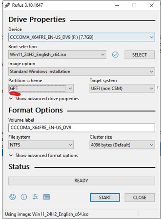

Still, no change, except for the fact that the the error message now only showed this: _"Setup doesn't support configuration of or installation to disks connected through a USB or IEEE1394 port."_

But still, the problem persisted, the installer couldn't recognize the SSD.

**Action 4. - IRST driver from INTEL website**

Remember I originally downloaded the IRST driver from ASUS's website? Then, inspired by [this reddit post](https://www.reddit.com/r/WindowsHelp/comments/19b8ov1/my_windows_11_installer_doesnt_detect_ssd/), I downloaded it from [Intel's website](https://www.intel.com/content/www/us/en/download/720755/intel-rapid-storage-technology-driver-installation-software-with-intel-optane-memory-11th-up-to-13th-gen-platforms.html). The issue here however was that this downloaded file is an executable `.exe`, which [the Windows installer cannot handle](https://www.reddit.com/r/intel/comments/1762sj6/intel_rst_vmd_driver_is_now_an_exe_and_not/). Trust me, I tried.

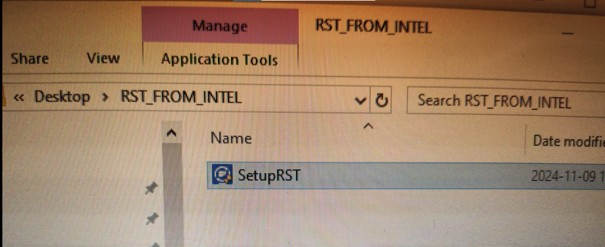

What helped me was that I opened PowerShell, located the .exe file as suggested [in this post](https://www.reddit.com/r/intel/comments/1762sj6/intel_rst_vmd_driver_is_now_an_exe_and_not/), then I ran this code:

`./SetupRST.exe -extractdrivers SetupRST_extracted`

So this basically **_extracted (not installed!)_** the contents of this .exe file into a separate folder, like so:

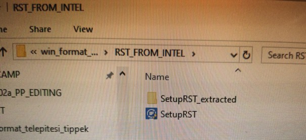

This I copied onto my USB stick and initialized the Windows installer process, again. Arrived to the _Select location to install Win11_ window where I clicked on _Load driver_, found the driver (I had to go way down to here):

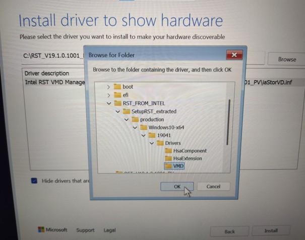

I selected _VMD controller_ (_not_ the VMD managed controller!).

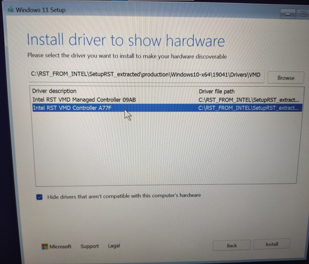

At last, the 1TB SSD was recognized!

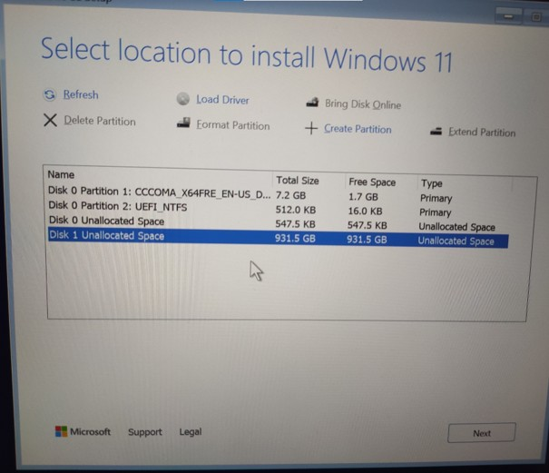

**Additional issues - no network adapter driver, running out of USB ports**

However, my adventures were not over at this point. I continued the installation, and later the installer requested a network adapter driver to be able to connect to my wifi. (There's no option to just skip this.)

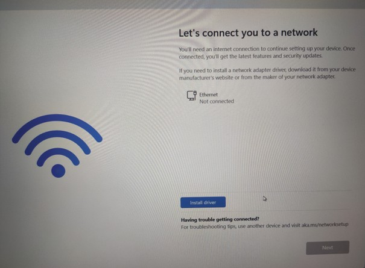

So I researched, found this [ASUS website](https://www.asus.com/support/faq/1048624/) which proved to be helpful. I followed the instructions, downloaded [this driver](https://www.intel.com/content/www/us/en/download/727998/intel-network-adapter-driver-for-microsoft-windows-11.html) (Wired_driver_29.3_x64) from Intel's website, named _Intel® Network Adapter Driver for Microsoft* Windows* 11_:

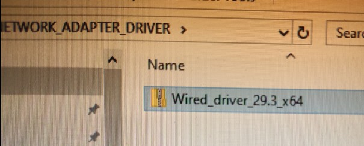

Extracted it, coped it to a second USB stick and inserted this into the 1 remaining USB port. Then, continued following the [ASUS website](https://www.asus.com/support/faq/1048624/) instructions: pressed SHIFT+F10 to open the command prompt. (You might need to press ALT+TAB couple of times, to make the window active, otherwise you won't be able to type! I couldn't use the mouse to click on the window since I ran out of available USB ports, the touchpad was inactive and I had no USB hubs.) Typed in `explorer.exe`. It opened the Windows Explorer, so I could find the installer using the TAB and arrowkeys:

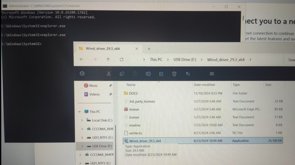

Unfortunately, it said _No Intel Network Connections found on this computer. No drivers were installed._

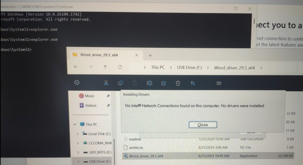

So I continued researching, I found another driver from [Intel's website here](https://www.intel.com/content/www/us/en/download/19351/intel-wireless-wi-fi-drivers-for-windows-10-and-windows-11.html), called _Intel® Wireless Wi-Fi Drivers for Windows® 10 and Windows 11*_. I copied it to my second USB stick, inserted this into the remaining USB port. Then, similarly to before: pressed SHIFT+F10 to open the command prompt, ALT+TAB couple of times to make the window active, typed `explorer.exe`. It opened the Windows Explorer, so I could find the installer using the TAB and arrowkeys:

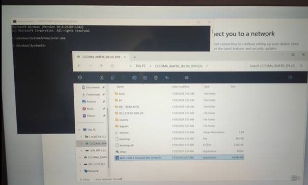

I opened it successfully, but then I bumped into a strange issue here at this point:

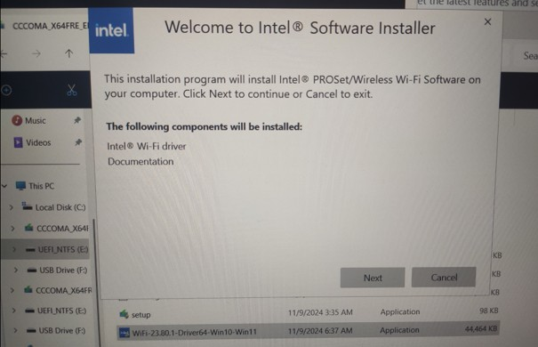

That is, I am supposed to click on Next, but how? There are only 2 USB ports on ASUS TUF F15 and as I said, I was already using both of them. I couldn't just plug them out obviously since that would crash the whole installation. No mouse, touchpad inactive.

What helped me was (outside of going to the local electronics store to buy a USB hub), I had to press ALT or ALT+TAB multiple times, thus underscores appeared under cetain characters in the buttons. As you can see here, `N` in `Next` became underscored.

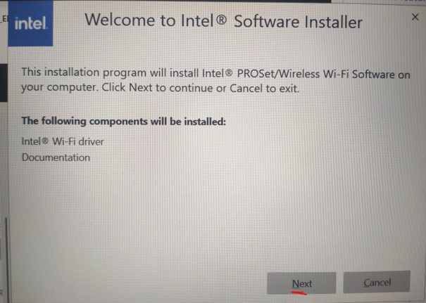

By pressing N and applying this similar method in the following prompts, I could finally complete the Wireless Wi-Fi Driver installation.

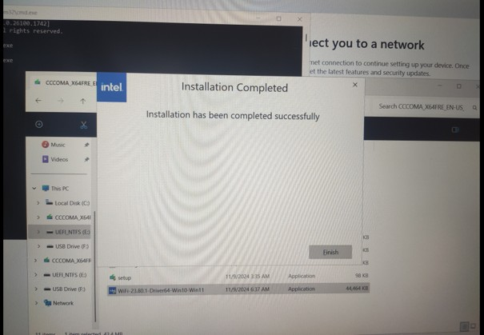

Pressing F (of **F**inish) in this last window didn't work, but it's not important since it's just a message of the completion. Pressing ALT+F4 closed this and the other open windows: the Wi-Fi Driver installer, the command prompt, the Windows explorer. At this point I just had to connect to my Wi-Fi, and that's it.

With this, the hard part was over. From this moment in, it was just standard procedure, answering standard questions from Windows installer, clicking OK and NEXT etc.

Note that I used ChatGPT a lot during the process, it probably could be helpful to you, too. Hope all this helps a bit. Also, it might be worth purchasing a USB hub beforehand...

Other sources that gave me inspirations during the process:

- [https://www.reddit.com/r/ASUS/comments/u21peo/im_trying_to_install_windows_on_my_asus_tuf_dash/](https://www.reddit.com/r/ASUS/comments/u21peo/im_trying_to_install_windows_on_my_asus_tuf_dash/)
- [https://www.reddit.com/r/buildapc/comments/7utlm1/windows_cannot_be_installed_to_this_disk_the/?rdt=49842](https://www.reddit.com/r/buildapc/comments/7utlm1/windows_cannot_be_installed_to_this_disk_the/?rdt=49842)
- [https://www.reddit.com/r/Asustuf/comments/lz7ptw/asus_tuf_dash_f15_no_ssd_during_windows/](https://www.reddit.com/r/Asustuf/comments/lz7ptw/asus_tuf_dash_f15_no_ssd_during_windows/)
